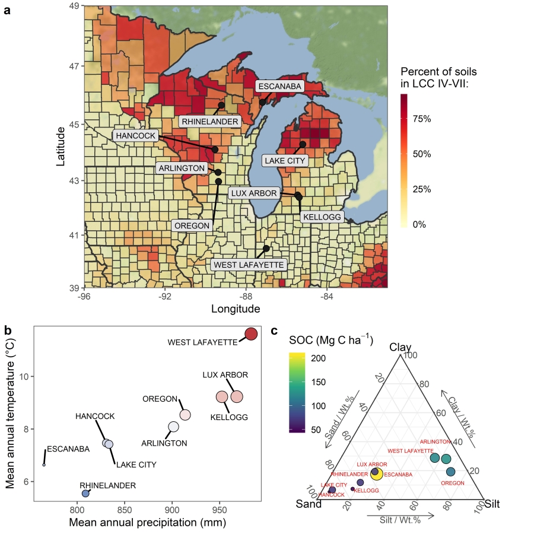

# Simulated soil carbon changes in switchgrass grown on marginal lands under climate change and adaptation strategies

## Overview

This is repository contains simulated data of soil organic carbon (SOC) changes under bioenergy switchgrass under current and projected climate. The data was generated using the Systems Approach to Land-Use Sustainability (SALUS) model. SALUS is a cropping systems simulation platform that contains processed-based models derived from the well-validated CERES model, providing simulation of crop growth and development, and carbon, water, nitrogen (N), and phosphorus cycling dynamics on a daily time step. The model uses as input daily values of incoming solar radiation (MJ m^-2), maximum and minimum air temperature (°C), and rainfall (mm), as well as information on soil characteristics and management. For more information about the model visit: <https://basso.ees.msu.edu/salus/index.html>. 

We used measured soil data, management information and daily weather data from nine long-term experiments in the US Great Lakes region to drive the simualtions (see figure). Daily weather data (1980-2018) for all of the sites were retrieved from the North American Land Data Assimilation System project phase 2 (NLDAS-2) dataset using the location coordinates for each site.

### Climate change projections

We generated weather under future climates to reflect three Shared Socio-economic Pathways (SSP): a sustainability (SSP1-26), middle-of-the-road (SSP2-45), and high (SPP5-85) emission scenarios. Downscaled CMIP6 monthly climate projections for the 2081-2100 timeframe (~12 km resolution) were retrieved from the [WorldClim database](https://www.worldclim.org/data/cmip6/cmip6climate.html). We used the median ensemble prediction of five General Circulation Model runs: MRI-ESM2-0, MIROC6, IPSL-CM6A-LR, CNRM-CM6-1, and BCC-CSM2-MR. For each SPP scenario at each site, we calculated the delta in average monthly daily minimum and maximum temperatures and cumulative precipitation compared to the historical baseline (1981-2000). Then, we created future weather by modifying the historical daily weather with the calculated delta factors on a month-by-month basis. Additionally, we assumed CO_2 concentrations of 385, 450, 590 and 950 ppm for the Historical, SSP2-45, SSP3-70 and SSP5-85 climate scenarios, respectively (Meinshausen et al., 2019)

### Modeling scenarios 

Long-term SOC changes were simulated by configuring the SALUS model to run with 20 years of weather data at each site. Baseline management consisted on annual fertilization of 50 kg N ha-1 on 30-May (beginning on the third year after planting) and harvested on 15-Oct, with a harvest efficiency of 65% (i.e., 35% of total aboveground biomass production was non-harvestable plant litter detached before harvesting and other residue), which was based on the mean observed values across the sites. This management scenario was run for the historical weather benchmark (1981-2000).

In addition, we simulated adaptation treatments which included: three doses of N fertilizer (50, 75 and 100 kg N ha^-1 yr^-1); three harvest intensities (65, 55 and 45% AGB removal); and two genotypes (baseline and adapted). To simulate the 'adapted' genotype, we increased the thermal time requirement to reach maturity by 30% compared to the baseline (i.e., calibrated) genotype. Treatments were run within each site, climate scenario (historical, SSP1-26, SSP2-45 and SSP5-85), and a random (n=100; ±20%) sampling for the influential SALUS parameters, all in a full factorial grid (n = 64,800 simulations).

## Data description

Data and metadata tables are in the `data` folder. Accompaning `R` files for data tables include analysis code to derive figures 1.1 to 2.2 located in the `figures` folder. 

### Metadata files:

1. `simulation_factors.csv` contains the factor levels used for each simulation instance. Column definitions:
 + SimID: identifier key for simulation instance
 + FertilizerN: N fertilizer dose (50, 75 and 100 kg N ha^-1 yr^-1) 
 + BiomassRemoval: harvest intensities (65, 55 and 45%)
 + Genotype: baseline and adapted
 + ClimateScenario: Historical, SSP1-26, SSP2-45 and SSP5-85
 + ParmSetID: key for set of parameters used in simulation 

2. `site_description.csv` contains location and pedo-climatic characteristics of the 9 sites. Column definitions:
 + Site: Name of site
 + SoilID: Name of soil
 + lat: Latitiude (decimal degrees)
 + long: Longitude (decimal degrees)
 + MAT: mean annual temperature (1980-2018)
 + MAP: mean annual cumulative precipitation (1980-2018)
 + init_SOC: Initial soil organic C levels of full profile  (Mg C/ha, 1m)
 + BD: Bulk density of full profile (g/cm3)
 + texture: Soil clay content of full profile (%)

3. `SALUS_parameter_sets.csv` contains the sampled values for 10 influential SALUS parameters. Column definitions:
 + ParmSetID: key for set of parameters used in simulation
 + Genotype: baseline and adapted
 + PlntN_Em: Plant N content at emergence (kg N/kg dm) 
 + PlntN_Mt: Plant N content at maturity (kg N/kg dm)
 + relTT_Sn: Relative thermal time required for onset of senecence (0-1)
 + RootSenFac: Daily root senecence rate (g/g/d)
 + RUEmax: Maximum radiation-use efficiency (g/MJ m2)
 + RWPC1: Proportion of plant growth allocated to roots near emergence (0-1)
 + TbaseDev: Base temperature used for thermal time calculation (° C)
 + TTtoMatr: Thermal time needed to complete annual growth cycle (°C-days) 
 + ActO2CO2: Proportion of C respired during decomposition of active SOM pool (g/g) 
 + Slow2CO2: Proportion of C respired during decomposition of slow SOM pool (g/g)

 
### Datasets

1. `simulation_experiment_1.csv` contains predicted swichgrass biomass and SOC at each sites under current and projected climate scenarios. Column definitions:
 + SimID: identifier key for simulation instance
 + Site: Site name
 + Year: 1981-2018
 + DOY: day of year
 + SOC:	Soil Organic C for 1m profile (Mg C/ha)
 + AGB:	Swichgrass Aboveground biomass
 + C_In: Cumulative soil C inputs
 + C_Out: Cumulative soil C respired

2. `simulation_experiment_2.csv` contains predicted swichgrass biomass and SOC at each sites under current and projected climate scenarios and adaptation strategies.
 + SimID: identifier key for simulation instance
 + Site: Site name
 + deltaSOC: Mean annual rate of SOC change (Mg C/ha/yr)